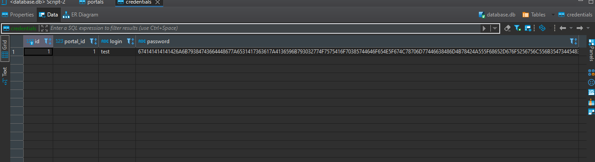

# Password Manager 
A simple Password Manager made using Tkinter and Python (3.10) . The passwords will be encrypted and stored in a SQL database. It doesn't rely on any web connection and hence, there will be fewer potential risks.

## Technologies
* Python 3.10+
* SQLite

### Libraries
* base64 (comes pre-installed with Python)
* hashlib (comes pre-installed with Python)
* Tkinter (comes pre-installed with Python)
* cryptography (pip install cryptography)
* SQLAlchemy ( pip install SQLAlchemy)

## Setup
* Clone this repo `git clone https://github.com/mduraj0/Password_manager.git` and install the necessary libraries
* run in python `python main.py install` to create database
* run in python `python main.py` to open password manager
* clicking on a given portal copies the password to the clipboard

## Screenshots

 
 
